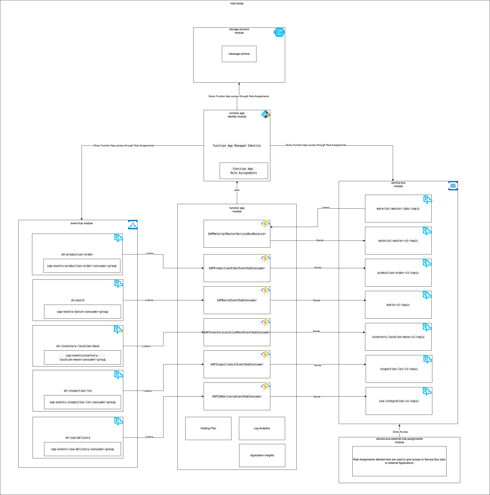

# SAP Integration Azure Infrastructure

This repository deploys Azure infrastructure that provides events and messages coming out of SAP,

To add Service Bus Role Assignment for your application, follow the instructions in the [Contributing](##Contributing) section.

## Infrastructure

The Bicep file [main.bicep](./main.bicep) contains the infrastructure that hosts this application:



## Run locally

You can run the Functions locally in the development environment using the following steps:

1. Disable the Function(s) you want to run in the [Azure Portal](https://portal.azure.com/#@wlgore.onmicrosoft.com/resource/subscriptions/e2fda199-cfde-4565-9bb3-08b676d05cc2/resourceGroups/rg-arb-8f9b03a7c50e787f9a6a332d6d10a85723251c54/providers/Microsoft.Web/sites/fa-uudmmlrz377qq/appServices)

2. Create the `functiona-app/local.settings.json` file using this template:

   ```json
   {
     "IsEncrypted": false,
     "Values": {
       "FUNCTIONS_WORKER_RUNTIME": "node",
       "AzureWebJobsFeatureFlags": "EnableWorkerIndexing",
       "MESSAGE_ARCHIVE_BLOB_SERVICE_URI": "https://sauudmmlrz377qq.blob.core.windows.net",
       "MesServiceBusConnection": "Endpoint=sb://...",
       "MesServiceBusConnection__fullyQualifiedNamespace": "sbn-uudmmlrz377qq.servicebus.windows.net",
       "SapEventHubConnection": "Endpoint=sb://...",
       "SAP_BASE_URL": "https://api.dv.sap.wlgore.com",
       "SAP_API_KEY": "...",
       "PRODUCTION_ORDER_EVENT_HUB_NAME": "eh-production-order-uudmmlrz377qq",
       "PRODUCTION_ORDER_EVENT_HUB_CONSUMER_GROUP": "sap-events-production-order-consumer-group",
       "PRODUCTION_ORDER_SERVICE_BUS_TOPIC_NAME": "production-order-v1-topic",
       "IDOC_MATERIAL_MASTER_SERVICE_BUS_TOPIC_NAME": "material-master-idoc-topic",
       "SERVICE_BUS_IDOC_MATERIAL_MASTER_TOPIC_SUBSCRIPTION": "material-master-idoc-topic-azure-function",
       "MATERIAL_MASTER_V1_SERVICE_BUS_TOPIC_NAME": "material-master-v1-topic",
       "BATCH_EVENT_HUB_NAME": "eh-batch-uudmmlrz377qq",
       "BATCH_EVENT_HUB_CONSUMER_GROUP": "sap-events-batch-consumer-group",
       "BATCH_SERVICE_BUS_TOPIC_NAME": "batch-v1-topic",
       "INVENTORY_LOCATION_MOVE_EVENT_HUB_NAME": "eh-inventory-location-move-uudmmlrz377qq",
       "INVENTORY_LOCATION_MOVE_EVENT_HUB_CONSUMER_GROUP": "sap-eventsinventory-location-move-consumer-group",
       "INVENTORY_LOCATION_MOVE_SERVICE_BUS_TOPIC_NAME": "inventory-location-move-v1-topic",
       "INSPECTION_LOT_EVENT_HUB_NAME": "eh-inspection-lot-uudmmlrz377qq",
       "INSPECTION_LOT_EVENT_HUB_CONSUMER_GROUP": "sap-events-inspection-lot-consumer-group",
       "INSPECTION_LOT_SERVICE_BUS_TOPIC_NAME": "inspection-lot-v1-topic",
       "COA_DELIVERY_EVENT_HUB_NAME": "eh-coa-delivery-uudmmlrz377qq",
       "COA_DELIVERY_EVENT_HUB_CONSUMER_GROUP": "sap-events-coa-delivery-consumer-group",
       "COA_INTEGRATION_SERVICE_BUS_TOPIC_NAME": "coa-integration-v1-topic"
     }
   }
   ```

3. Populate the `AzureWebJobsStorage` and `AzureStorageAccount` with the _Connection string_ in [Storage account &rarr; Access keys](https://portal.azure.com/#@wlgore.onmicrosoft.com/resource/subscriptions/e2fda199-cfde-4565-9bb3-08b676d05cc2/resourceGroups/rg-arb-8f9b03a7c50e787f9a6a332d6d10a85723251c54/providers/Microsoft.Storage/storageAccounts/sauudmmlrz377qq/keys)

4. Populate `MesServiceBusConnection` with the _Primary Connection String_ in [Service Bus &rarr; Settings &rarr; Shared access policies &rarr; RootManageSharedAccessKey](https://portal.azure.com/#@wlgore.onmicrosoft.com/resource/subscriptions/e2fda199-cfde-4565-9bb3-08b676d05cc2/resourceGroups/rg-arb-8f9b03a7c50e787f9a6a332d6d10a85723251c54/providers/Microsoft.ServiceBus/namespaces/sbn-uudmmlrz377qq/saskey)

5. Populate `SapEventHubConnection` with the _Primary Connection String_ in [Service Bus &rarr; Settings &rarr; Shared access policies &rarr; RootManageSharedAccessKey](https://portal.azure.com/#@wlgore.onmicrosoft.com/resource/subscriptions/e2fda199-cfde-4565-9bb3-08b676d05cc2/resourceGroups/rg-arb-8f9b03a7c50e787f9a6a332d6d10a85723251c54/providers/Microsoft.EventHub/namespaces/evhns-uudmmlrz377qq/saskey)

6. Populate service bus topic names and subscription names variables with _name_ values of the corresponding resources from [service-bus.bicep file](bicep/service-bus.bicep)

7. Populate event hub names and consumer group names with _name_ values of the corresponding resources from [service-bus.bicep file](bicep/event-hub.bicep)

8. Run the Function(s) locally. The Function name(s) can be found in `function-app/functions/**/*.ts`.

   ```sh
   cd function-app

   # Only once to install the dependencies
   npm ci

   # Run one particular Function
   npm run start -- --functions <function name>

   # Run all Functions
   npm run start
   ```

## Integration documentation

- [Batch Integration](docs/batch.md)
- [Certficate of Analysis (COA) Integration](docs/coa.md)
- [Inventory Location Move Integration](docs/inventory-location-move.md)
- [Inspection Lot Integration](docs/inspection-lot.md)
- [Material Master V1 Integration](docs/material-master.md)
- [Material Master V2 Integration](docs/material-master-v2.md)
- [Production Order Integration](docs/production-order.md)

## Deployment

This repository uses environment variables and secrets to deploy its resources.

### Repository variables

- `AZURE_TENANT_ID` is the Azure tenant where the Azure resources are deployed to, see [Azure Resource Ids (wlgore/information)](https://wlgore.github.io/information/docs/azure/resource-ids/)

### Environment variables

- `AZURE_SUBSCRIPTION_ID` is the subscription to where the Azure resources are deployed to, see [Azure Resource Ids (wlgore/information)](https://wlgore.github.io/information/docs/azure/resource-ids/gore-performance-solutions)

## Accessing logs

1. Open the Azure Portal and navigate to the resource group
2. Open the _Log Analytics workspace_ resource
3. Open the _Logs_ tab
   - [Log Analytics workspace (DEV)](https://portal.azure.com/#@wlgore.onmicrosoft.com/resource/subscriptions/e2fda199-cfde-4565-9bb3-08b676d05cc2/resourceGroups/rg-arb-8f9b03a7c50e787f9a6a332d6d10a85723251c54/providers/Microsoft.OperationalInsights/workspaces/log-uudmmlrz377qq/logs)
   - Log Analytics workspace (VAL)
   - Log Analytics workspace (PRD)
4. Use the query below to see the Function App logs

```kql title="Query Function App logs"
union AppTraces
| union AppExceptions
// Filter "Trigger Details" message, it just adds noise
| where Message !hasprefix "Trigger Details"
    // Find all logs produced by Functions
    // and customDimensions.Category startswith "Function"
    // Find all logs for a specific Function
    // and customDimensions.Category == 'Function.SAPBatchEventHubConsumer'
| order by TimeGenerated desc
| project
    TimeGenerated,
    Category = replace_string(tostring(Properties.Category), 'Function.', ''),
    Level = Properties.LogLevel,
    Message = iff(
        isnotempty(Message),
        Message,
        iff(
            isnotempty(InnermostMessage),
            InnermostMessage,
            OuterMessage
        )
    )
```

## Testing

[jest](https://www.npmjs.com/package/jest?activeTab=readme) is used for unit tests. Run the following commands to execute tests:

```bash
# Navigate to the Azure Functions folder
cd function-app

# (Optional) Install dependencies if they are not installed already
npm ci

# Start the Functions
npm run test
```

## Husky

This repository uses [husky](https://typicode.github.io/husky) to automatically [run checks](./function-app/.husky/pre-commit) in the background while you create Git commits.

While this should work without issues, it can happen that Git clients like [git-fork](https://git-fork.com/) produce `npm: command not found` errors. This happens, because the Git client does not have the same `PATH` variable as your terminal and, for example, does not have `npm` set up.

The solution is outlined in the [husky FAQ: Node Version Managers and GUIs](https://typicode.github.io/husky/how-to.html#node-version-managers-and-guis).

For example for nvm, create the following file and restart the Git client to resolve the error:

```sh
# ~/.config/husky/init.sh

# See https://typicode.github.io/husky/how-to.html#node-version-managers-and-guis
export NVM_DIR="$HOME/.nvm"

# This loads nvm
[ -s "$NVM_DIR/nvm.sh" ] && \. "$NVM_DIR/nvm.sh"
```

## Deploying to higher environments

To learn more about the deployment strategy, [click here](https://animated-system-j5k1lor.pages.github.io/docs/actions/environments/).

## Troubleshooting

You can find resolutions to common errors [here](./docs/troubleshooting.md).

## Contributing

To add Service Bus Role Assignment(s) for your application, follow these steps:

1. Create an enviroment variable for the Principal ID of your application in the [Development](https://github.com/goreperformancesolution/sap-integration-azure-infrastructure/settings/environments/3615339149/edit) environment, following this naming convention `${YOUR_APP_NAME}_${YOUR_APP_TYPE}_PRINCIPAL_ID` for e.g. `COMPASS_FUNCTION_APP_PRINCIPAL_ID`. Value for the `${YOUR_APP_TYPE}` placeholder could be `FUNCTION_APP` or `CONTRAINER_APP` etc.
2. Create a feature brach, where you will add your changes. The feature branch name should start with the `features/` prefix.
3. Add topic subscription(s) for your application in the `bicep/service-bus/subscriptions.bicep` file, see [bicep/README.md](bicep/README.md).
4. Add a parameter for the Principal ID of your application and role assignment(s) for your application in the `bicep/service-bus-role-assignments.bicep`file.
5. Add a parameter for the Principal ID of your application in the `main.bicep`file and use it to provide value for the parameter, you defined in the previous step, in the `module serviceBusRoleAssignments`.
6. Add a parameter for the Principal ID of your application to the `Deploy Bicep` step of the `deploy` in the `.github/workflows/deploy-azure.yaml`file.
7. Create a Pull Request (PR) with your feature branch as the source branch and the main branch as the target branch. Put @jtusevlj_gore, @ckulka_gore, @tfleck_gore or @kppatel_gore as Reviewers.
