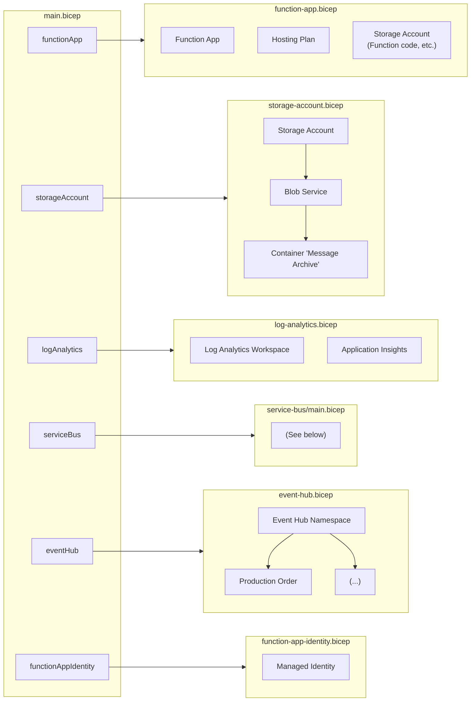
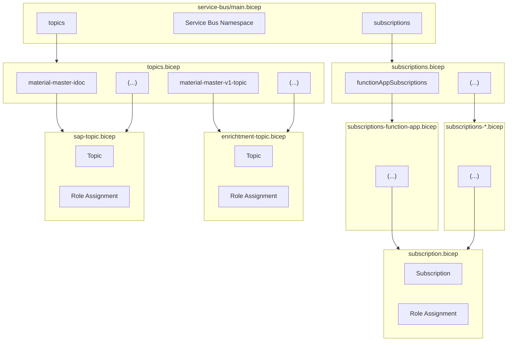

# Infrastructure

This file describes how the different Bicep files relate to each other to deploy the infrastructure of this repository.

- [main.bicep](../main.bicep) is the main Bicep file referenced in the GitHub workflows to deploy the entire infrastructure. It references other Bicep files in the [`bicep` folder](.).
- [bicep/function-app.bicep](function-app.bicep) creates the [Azure Function App](../function-app/) of this repository.
- [bicep/storage-account.bicep](storage-account.bicep) creates the Storage Account used to store payloads, e.g. incoming and outgoing messages for debugging purposes.
- [bicep/log-analytics.bicep](log-analytics.bicep) creates the Log Analytics workspace and Application Insights, e.g. to store logs and monitor metrics.
- [bicep/event-hub.bicep](event-hub.bicep) creates the Event Hub where SAP publishes events to that the Function App then consumes.
- [bicep/service-bus/main.bicep](service-bus/enrichment-topic.bicep) deploys all Service Bus related resources, more details are below.

The [`bicep/service-bus`](service-bus/) folder contains the following files:

- [`main.bicep`](service-bus/main.bicep) is referenced by the repository root's [`main.bicep`](../main.bicep) (see above) and creates the Service Bus and related infrastructure by referencing `topics.bicep` and `subscriptions.bicep`.
- [`subscriptions.bicep`](service-bus/subscriptions.bicep) references the `subscription-*.bicep` files to create all subscriptions.
- `subscriptions-<consumer>.bicep` uses [`subscription.bicep`](service-bus/subscription.bicep) to create all subscriptions for a consumer.
- [`subscription.bicep`](service-bus/subscription.bicep) creates a subscription for a topic and the permissions for the consumer to receive messages from it.
- [`subscriptions-coa.bicep`](service-bus/subscriptions-coa.bicep) uses [`subscription.bicep`](service-bus/subscription.bicep) to create all subscriptions for the COA app.
- [`subscriptions-compass.bicep`](service-bus/subscriptions-compass.bicep) uses [`subscription.bicep`](service-bus/subscription.bicep) to create all subscriptions for the [Compass integration](https://github.com/goreperformancesolution/sap-compass-azure-integration).
- [`subscriptions-function-app.bicep`](service-bus/subscriptions-function-app.bicep) uses [`subscription.bicep`](service-bus/subscription.bicep) to create all subscriptions for the Function App of this repository.
- [`subscriptions-nemo01.bicep`](service-bus/subscriptions-nemo01.bicep) uses [`subscription.bicep`](service-bus/subscription.bicep) to create all subscriptions for the [Nemo01 integration](https://github.com/goreperformancesolution/sap-nemo01-azure-integration).
- [`topics.bicep`](service-bus/topics.bicep) creates all Service Bus topics by referencing [`enrichment-topic.bicep`](service-bus/enrichment-topic.bicep) and [`sap-topic.bicep`](service-bus/sap-topic.bicep).
- [`enrichment-topic.bicep`](service-bus/enrichment-topic.bicep) creates a single topic that the Function App can publish to.
- [`sap-topic.bicep`](service-bus/sap-topic.bicep) creates a single topic that SAP can publish to.

