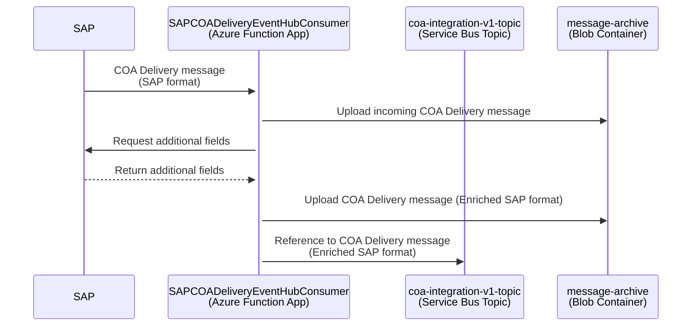

# Certificate of Analysis Delivery (COA) Integration

SAP sends a custom message COA Delivery (SAP JSON format) to the Azure resources provided by this repository. The incoming message (e.g. [here](../function-app/test/resources/SAPCOADeliveryEventHubConsumer/input.json)) is enriched with the data coming from the following custom SAP API:

- Get Freight Orders - GET /freightordercoa/v1/ZFODELCOASet?$filter=FreightOrder eq '{freightOrder}'

and published to the Azure Service Bus topic _coa-integration-v1-topic_. The logic is contained in [SAPCOADeliveryEventHubConsumer Function](../function-app/src/functions/SAPCOADeliveryEventHubConsumer.ts) which listens to the messages from Event Hub topic _eh-inspection-lot-\*_ and performs the following steps:

1. Takes the IDs from the incoming message
2. Uploads the input message to the Azure Storage Blob Container
3. Calls SAP API with the Freight Order Number from step 1 to fetch additional data and enrich the incoming message
4. Uploads the enriched message to the Azure Storage Blob Container
5. Publishes the reference to enriched message to the Service Bus queue _coa-integration-v1-topic_

Pending messages can be viewed in the Azure Portal:

- [Azure Event Hub for COA Delivery (DEV)](https://portal.azure.com/#@wlgore.onmicrosoft.com/resource/subscriptions/e2fda199-cfde-4565-9bb3-08b676d05cc2/resourceGroups/rg-arb-8f9b03a7c50e787f9a6a332d6d10a85723251c54/providers/Microsoft.EventHub/namespaces/evhns-uudmmlrz377qq/eventhubs/eh-coa-delivery-uudmmlrz377qq/overview) 
- [Azure Event Hub for COA Delivery (VAL)](https://portal.azure.com/#@wlgore.onmicrosoft.com/resource/subscriptions/d5c0187e-4b27-48b7-8592-f28f897fed9c/resourceGroups/rg-arb-a915fcf60a914831589e4348f82b54b263257fe4/providers/Microsoft.EventHub/namespaces/evhns-3usitng2rgrns/eventhubs)
- [Azure Event Hub for COA Delivery (PRD)](https://portal.azure.com/#@wlgore.onmicrosoft.com/resource/subscriptions/dc554c52-a946-4663-993f-ad838cc62de9/resourceGroups/rg-arb-b36ffe2259e1a7c348a5bda1f0bbb74dcd56f270/providers/Microsoft.EventHub/namespaces/evhns-52qfhgssyyol6/eventhubs/eh-coa-delivery-52qfhgssyyol6/overview)
- [Azure Service Bus _coa-integration-v1-topic_ (DEV)](https://portal.azure.com/#@wlgore.onmicrosoft.com/resource/subscriptions/e2fda199-cfde-4565-9bb3-08b676d05cc2/resourceGroups/rg-arb-8f9b03a7c50e787f9a6a332d6d10a85723251c54/providers/Microsoft.ServiceBus/namespaces/sbn-uudmmlrz377qq/topics/coa-integration-v1-topic/explorer) 
- [Azure Service Bus _coa-integration-v1-topic_ (VAL)](https://portal.azure.com/#@wlgore.onmicrosoft.com/resource/subscriptions/d5c0187e-4b27-48b7-8592-f28f897fed9c/resourceGroups/rg-arb-a915fcf60a914831589e4348f82b54b263257fe4/providers/Microsoft.ServiceBus/namespaces/sbn-3usitng2rgrns/topics/coa-integration-v1-topic/explorer)
- [Azure Service Bus _coa-integration-v1-topic_ (PRD)](https://portal.azure.com/#@wlgore.onmicrosoft.com/resource/subscriptions/dc554c52-a946-4663-993f-ad838cc62de9/resourceGroups/rg-arb-b36ffe2259e1a7c348a5bda1f0bbb74dcd56f270/providers/Microsoft.ServiceBus/namespaces/sbn-52qfhgssyyol6/topics/coa-integration-v1-topic/explorer)

