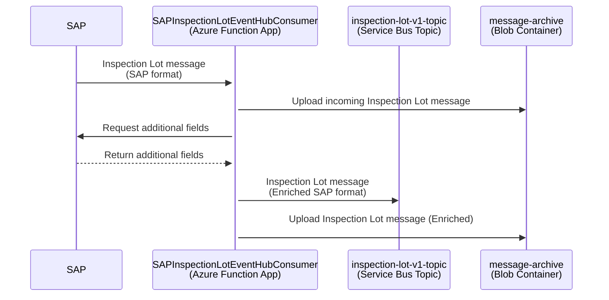

# Inspection Lot Integration

SAP sends the Inspection Lot message (SAP JSON format) to the Azure resources provided by this repository. The incoming message (e.g. [here](../function-app/test/resources/SAPInspectionLotEventHubConsumer/input.json)) is enriched with the data coming from the following SAP APIs:

- Get Inspection Lot by ID - [GET /inspectionlot/v1/A_InspectionLot('{InspectionLot}')](https://api.sap.com/api/OP_API_INSPECTIONLOT_SRV_0001/path/get_A_InspectionLot___InspectionLot___)
- Get Inspection Lot Statuses for a Given Inspection Lot [GET /inspectionlot/v1/A_InspectionLot('{InspectionLot}')/to_InspectionLotWithStatus](https://api.sap.com/api/OP_API_INSPECTIONLOT_SRV_0001/path/get_A_InspectionLot___InspectionLot____to_InspectionLotWithStatus)
- Get Batch Master Record by ID - [GET /batchmaster/v1/Batch(Material='{Material}',BatchIdentifyingPlant='{BatchIdentifyingPlant}',Batch='{Batch}')](https://api.sap.com/api/OP_API_BATCH_SRV_0001/resource/Batches)
- Get Batch Characteristics for Given Batch - [GET /batchmaster/v1/Batch(Material='{Material}',BatchIdentifyingPlant='{BatchIdentifyingPlant}',Batch='{Batch}')/to_BatchCharc](https://api.sap.com/api/OP_API_BATCH_SRV_0001/path/get_Batch_Material___Material___BatchIdentifyingPlant___BatchIdentifyingPlant___Batch___Batch____to_BatchCharc)
- Get Batch Characteristic Value for Given Characteristic - [GET /batchmaster/v1/BatchCharc(Material='{Material}',BatchIdentifyingPlant='{BatchIdentifyingPlant}',Batch='{Batch}',CharcInternalID='{CharcInternalID}')/to_BatchCharcValue](https://api.sap.com/api/OP_API_BATCH_SRV_0001/path/get_BatchCharc_Material___Material___BatchIdentifyingPlant___BatchIdentifyingPlant___Batch___Batch___CharcInternalID___CharcInternalID____to_BatchCharcValue)
- Get Characteristic Description for Given Characteristic - [GET /classificationcharacteristic/v1/A_ClfnCharcDescForKeyDate(CharcInternalID='{CharcInternalID}',Language='{Language}')](https://api.sap.com/api/OP_API_CLFN_CHARACTERISTIC_SRV/path/get_A_ClfnCharcDescForKeyDate_CharcInternalID___CharcInternalID___Language___Language___)

and published to the Azure Service Bus topic _inspection-lot-v1-topic_. The logic is contained in [SAPInspectionLotEventHubConsumer Function](../function-app/src/functions/SAPInspectionLotEventHubConsumer.ts) which listens to the messages from Event Hub topic _eh-inspection-lot-\*_ and performs the following steps:

1. Takes the IDs from the incoming message
2. Uploads the input message to the Azure Storage Blob Container
3. Calls SAP APIs with the IDs from step 1 to fetch additional data and enrich the incoming message
4. Uploads the enriched message to the Azure Storage Blob Container
5. Publishes the enriched message in JSON format to the Service Bus queue _inspection-lot-v1-topic_

Pending messages can be viewed in the Azure Portal:

- [Azure Event Hub for Inspection Lot (DEV)](https://portal.azure.com/#@wlgore.onmicrosoft.com/resource/subscriptions/e2fda199-cfde-4565-9bb3-08b676d05cc2/resourceGroups/rg-arb-8f9b03a7c50e787f9a6a332d6d10a85723251c54/providers/Microsoft.EventHub/namespaces/evhns-uudmmlrz377qq/eventhubs/eh-inventory-location-move-uudmmlrz377qq/overview) (DEV)
- [Azure Event Hub for Inspection Lot (VAL)](https://portal.azure.com/#@wlgore.onmicrosoft.com/resource/subscriptions/d5c0187e-4b27-48b7-8592-f28f897fed9c/resourceGroups/rg-arb-a915fcf60a914831589e4348f82b54b263257fe4/providers/Microsoft.EventHub/namespaces/evhns-3usitng2rgrns/eventhubs/eh-inspection-lot-3usitng2rgrns/overview)
- [Azure Event Hub for Inspection Lot (PRD)](https://portal.azure.com/#@wlgore.onmicrosoft.com/resource/subscriptions/dc554c52-a946-4663-993f-ad838cc62de9/resourceGroups/rg-arb-b36ffe2259e1a7c348a5bda1f0bbb74dcd56f270/providers/Microsoft.EventHub/namespaces/evhns-52qfhgssyyol6/eventhubs/eh-inspection-lot-52qfhgssyyol6/overview)
- [Azure Service Bus _inspection-lot-v1-topic_ (DEV)](https://portal.azure.com/#@wlgore.onmicrosoft.com/resource/subscriptions/e2fda199-cfde-4565-9bb3-08b676d05cc2/resourceGroups/rg-arb-8f9b03a7c50e787f9a6a332d6d10a85723251c54/providers/Microsoft.ServiceBus/namespaces/sbn-uudmmlrz377qq/topics/inventory-location-move-v1-topic/explorer) (DEV)
- [Azure Service Bus _inspection-lot-v1-topic_ (VAL)](https://portal.azure.com/#@wlgore.onmicrosoft.com/resource/subscriptions/d5c0187e-4b27-48b7-8592-f28f897fed9c/resourceGroups/rg-arb-a915fcf60a914831589e4348f82b54b263257fe4/providers/Microsoft.ServiceBus/namespaces/sbn-3usitng2rgrns/topics/inspection-lot-v1-topic/explorer)
- [Azure Service Bus _inspection-lot-v1-topic_ (PRD)](https://portal.azure.com/#@wlgore.onmicrosoft.com/resource/subscriptions/dc554c52-a946-4663-993f-ad838cc62de9/resourceGroups/rg-arb-b36ffe2259e1a7c348a5bda1f0bbb74dcd56f270/providers/Microsoft.ServiceBus/namespaces/sbn-52qfhgssyyol6/topics/inspection-lot-v1-topic/explorer)

