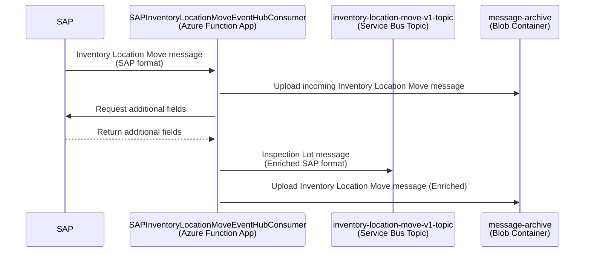

# Inventory Location Move to PSA

SAP sends the Inventory Location Move to PSA message (SAP JSON format) to the Azure resources provided by this repository. The incoming message (e.g. [here](../function-app/test/resources/SAPInventoryLocationMoveEventHubConsumer/input.json)) is enriched with the data coming from the following SAP APIs:

- Get Warehouse Available Stock (custom API) - GET /whseavailablestock/v1/WarehouseAvailableStock?$filter=EWMWarehouse eq 'EWMWarehouse' and EWMStorageType eq 'EWMStorageType' and Product eq 'Product' and Batch eq 'Batch'
- Get Batch Master Record by ID - [GET /batchmaster/v1/Batch(Material='{Material}',BatchIdentifyingPlant='{BatchIdentifyingPlant}',Batch='{Batch}')](https://api.sap.com/api/OP_API_BATCH_SRV_0001/resource/Batches)
- Get product master record [GET /materialclassification/v1/A_ClfnProduct('{Product}')](https://api.sap.com/api/OP_API_CLFN_PRODUCT_SRV/resource/Product)
- Get Characteristic Description for Given Characteristic - [GET /classificationcharacteristic/v1/A_ClfnCharcDescForKeyDate(CharcInternalID='{CharcInternalID}',Language='{Language}')](https://api.sap.com/api/OP_API_CLFN_CHARACTERISTIC_SRV/path/get_A_ClfnCharcDescForKeyDate_CharcInternalID___CharcInternalID___Language___Language___)

and published to the Azure Service Bus topic _inventory-location-move-v1-topic_. The logic is contained in [SAPInventoryLocationMoveEventHubConsumer Function](../function-app/src/functions/SAPInventoryLocationMoveEventHubConsumer.ts) which listens to the messages from Event Hub topic _eh-inventory-location-move-\*_ and performs the following steps:

1. Takes the fields from the incoming message
2. Uploads the input message to the Azure Storage Blob Container
3. Calls SAP APIs using fields from step 1 as input to fetch additional data and enrich the incoming message
4. Adds BaseUnitISOCode field to the enriched message by converting BaseUnit field to ISO code using this [conversion table](../function-app/src/conversions/uom.csv).
5. Uploads the enriched message to the Azure Storage Blob Container
6. Publish the enriched message in JSON format to the Service Bus queue _inventory-location-move-v1-topic_

Pending messages can be viewed in the Azure Portal:

- [Azure Event Hub for Inventory Location Move (DEV)](https://portal.azure.com/#@wlgore.onmicrosoft.com/resource/subscriptions/e2fda199-cfde-4565-9bb3-08b676d05cc2/resourceGroups/rg-arb-8f9b03a7c50e787f9a6a332d6d10a85723251c54/providers/Microsoft.EventHub/namespaces/evhns-uudmmlrz377qq/eventhubs/eh-inspection-lot-uudmmlrz377qq/explorer) (DEV)
- [Azure Event Hub for Inventory Location Move (VAL)](https://portal.azure.com/#@wlgore.onmicrosoft.com/resource/subscriptions/d5c0187e-4b27-48b7-8592-f28f897fed9c/resourceGroups/rg-arb-a915fcf60a914831589e4348f82b54b263257fe4/providers/Microsoft.EventHub/namespaces/evhns-3usitng2rgrns/eventhubs/eh-inventory-location-move-3usitng2rgrns/overview)
- [Azure Event Hub for Inventory Location Move (PRD)](https://portal.azure.com/#@wlgore.onmicrosoft.com/resource/subscriptions/dc554c52-a946-4663-993f-ad838cc62de9/resourceGroups/rg-arb-b36ffe2259e1a7c348a5bda1f0bbb74dcd56f270/providers/Microsoft.EventHub/namespaces/evhns-52qfhgssyyol6/eventhubs/eh-inventory-location-move-52qfhgssyyol6/overview)
- [Azure Service Bus _inventory-location-move-v1-topic_ (DEV)](https://portal.azure.com/#@wlgore.onmicrosoft.com/resource/subscriptions/e2fda199-cfde-4565-9bb3-08b676d05cc2/resourceGroups/rg-arb-8f9b03a7c50e787f9a6a332d6d10a85723251c54/providers/Microsoft.ServiceBus/namespaces/sbn-uudmmlrz377qq/topics/inventory-location-move-v1-topic/explorer) (DEV)
- [Azure Service Bus _inventory-location-move-v1-topic_ (VAL)](https://portal.azure.com/#@wlgore.onmicrosoft.com/resource/subscriptions/d5c0187e-4b27-48b7-8592-f28f897fed9c/resourceGroups/rg-arb-a915fcf60a914831589e4348f82b54b263257fe4/providers/Microsoft.ServiceBus/namespaces/sbn-3usitng2rgrns/topics/inventory-location-move-v1-topic/explorer)
- [Azure Service Bus _inventory-location-move-v1-topic_ (PRD)](https://portal.azure.com/#@wlgore.onmicrosoft.com/resource/subscriptions/dc554c52-a946-4663-993f-ad838cc62de9/resourceGroups/rg-arb-b36ffe2259e1a7c348a5bda1f0bbb74dcd56f270/providers/Microsoft.ServiceBus/namespaces/sbn-52qfhgssyyol6/topics/inventory-location-move-v1-topic/explorer)

