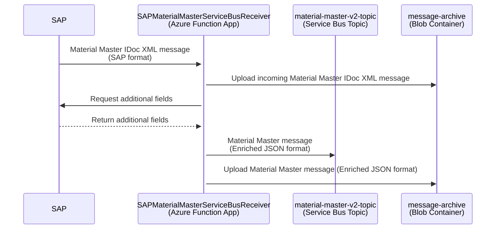

# Material Master Integration

SAP sends the Material Master message [MATMASO6 IDoc XML message](https://help.sap.com/docs/SAP_S4HANA_ON-PREMISE/25a41481f62e469ba0e61015a0d39d20/3e43625476120d4ee10000000a423f68.html) to the Azure resources provided by this repository. The incoming message (e.g. [here](../function-app/test/resources/SAPMaterialMasterServiceBusReceiver/input-single-plant.xml)) is enriched with the data coming from the following SAP APIs:

- Get product master record [GET /materialclassification/v1/A_ClfnProduct('{Product}')](https://api.sap.com/api/OP_API_CLFN_PRODUCT_SRV/resource/Product)
- Get Characteristic description for given characteristic - [GET /classificationcharacteristic/v1/A_ClfnCharcDescForKeyDate(CharcInternalID='{CharcInternalID}',Language='{Language}')](https://api.sap.com/api/OP_API_CLFN_CHARACTERISTIC_SRV/path/get_A_ClfnCharcDescForKeyDate_CharcInternalID___CharcInternalID___Language___Language___)

and published to the Azure Service Bus topic _material-master-v2-topic_. Two custom fields are added and they all use __WLG_ suffix which indicates that they are custom:

- BaseUnitISOCode_WLG - Product Master Base Unit of Measure ISO Code
- to_Description_WLG - Description of the Product Class Characteristic in the $.d.to_ProductClass.results.to_Characteristics.results array

The logic is contained in [SAPMaterialMasterServiceBusReceiverV2 Function](../function-app/src/functions/SAPMaterialMasterServiceBusReceiverV2.ts) which listens to the messages from Service Bus topic _material-master-idoc-topic_ and performs the following steps:

1. Takes Material Number and other relevant fields from the IDoc XML incoming message
2. Uploads the input message to the Azure Storage Blob Container
3. Calls SAP APIs with the Material Number to fetch additional data (Class Assignments and Characteristics) to compose the enrich message in JSON format
4. Adds BaseUnitISOCode field to the enriched message by converting BaseUnit field to ISO code using this [conversion table](../function-app/src/conversions/uom.csv).
5. Uploads the enriched message to the Azure Storage Blob Container
6. Publishes the enriched message (e.g. [here](../function-app/test/resources/SAPMaterialMasterServiceBusReceiver/expected-single-plant.json)) in JSON format to the Service Bus queue _material-master-v2-topic_

Pending messages can be viewed in the Azure Portal:

- [Azure Service Bus for _material-master-idoc-topic_ (DEV)](https://portal.azure.com/#@wlgore.onmicrosoft.com/resource/subscriptions/e2fda199-cfde-4565-9bb3-08b676d05cc2/resourceGroups/rg-arb-8f9b03a7c50e787f9a6a332d6d10a85723251c54/providers/Microsoft.ServiceBus/namespaces/sbn-uudmmlrz377qq/topics/material-master-idoc-topic/explorer) (DEV)
- [Azure Event Hub for _material-master-idoc-topic_ (VAL)](https://portal.azure.com/#@wlgore.onmicrosoft.com/resource/subscriptions/d5c0187e-4b27-48b7-8592-f28f897fed9c/resourceGroups/rg-arb-a915fcf60a914831589e4348f82b54b263257fe4/providers/Microsoft.ServiceBus/namespaces/sbn-3usitng2rgrns/topics/material-master-idoc-topic/explorer)
- [Azure Event Hub for _material-master-idoc-topic_ (PRD)](https://portal.azure.com/#@wlgore.onmicrosoft.com/resource/subscriptions/dc554c52-a946-4663-993f-ad838cc62de9/resourceGroups/rg-arb-b36ffe2259e1a7c348a5bda1f0bbb74dcd56f270/providers/Microsoft.ServiceBus/namespaces/sbn-52qfhgssyyol6/topics/material-master-idoc-topic/explorer)
- [Azure Service Bus _material-master-v2-topic_ (DEV)](https://portal.azure.com/#@wlgore.onmicrosoft.com/resource/subscriptions/e2fda199-cfde-4565-9bb3-08b676d05cc2/resourceGroups/rg-arb-8f9b03a7c50e787f9a6a332d6d10a85723251c54/providers/Microsoft.ServiceBus/namespaces/sbn-uudmmlrz377qq/topics/material-master-v2-topic/explorer) (DEV)
- [Azure Service Bus _material-master-v2-topic_ (VAL)](https://portal.azure.com/#@wlgore.onmicrosoft.com/resource/subscriptions/d5c0187e-4b27-48b7-8592-f28f897fed9c/resourceGroups/rg-arb-a915fcf60a914831589e4348f82b54b263257fe4/providers/Microsoft.ServiceBus/namespaces/sbn-3usitng2rgrns/topics/material-master-v2-topic/explorer)
- [Azure Service Bus _material-master-v2-topic_ (PRD)](https://portal.azure.com/#@wlgore.onmicrosoft.com/resource/subscriptions/dc554c52-a946-4663-993f-ad838cc62de9/resourceGroups/rg-arb-b36ffe2259e1a7c348a5bda1f0bbb74dcd56f270/providers/Microsoft.ServiceBus/namespaces/sbn-52qfhgssyyol6/topics/material-master-v2-topic/explorer)

## Service Bus Material Master V2 Topic Enriched Message fields

You can find the an example of the Material Master V2 Topic Enriched Message [here](../function-app/test/resources/SAPMaterialMasterServiceBusReceiverV2/expected-multiple-plants.json).
