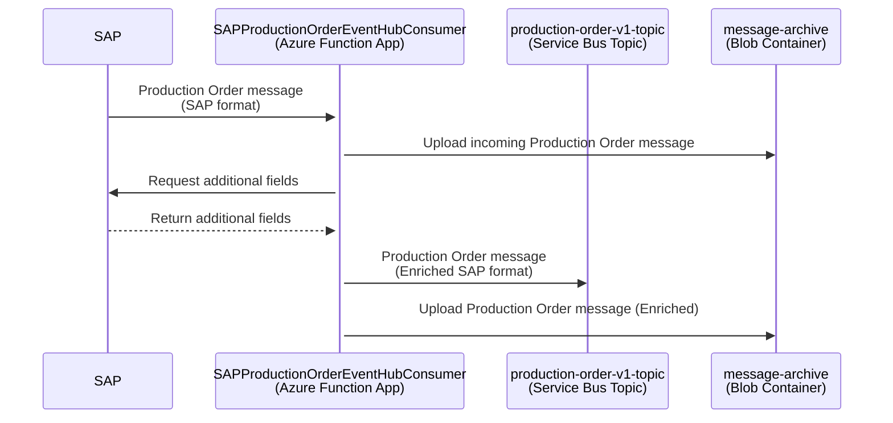

# Production Order Integration

SAP sends the Production Order message (SAP format) to the Azure resources provided by this repository. The incoming message (e.g. [here](../function-app/test/resources/SAPProductionOrderEventHubConsumer/input.json)) is enriched with the data coming from the following SAP APIs:

- Get Production Order by ID - [GET /productionorder/v1/A_ProductionOrder_2('{ManufacturingOrder}')](https://api.sap.com/api/OP_API_PRODUCTION_ORDER_2_SRV_0001/path/get_A_ProductionOrder_2___ManufacturingOrder___)
- Get Production Order Components for a Given Production Order - [GET /productionorder/v1/A_ProductionOrder_2('{ManufacturingOrder}')/to_ProductionOrderComponent](https://api.sap.com/api/OP_API_PRODUCTION_ORDER_2_SRV_0001/path/get_A_ProductionOrder_2___ManufacturingOrder___)
- Get Production Order Operations for a Given Production Order - [GET /productionorder/v1/A_ProductionOrder_2('{ManufacturingOrder}')/to_ProductionOrderOperation](https://api.sap.com/api/OP_API_PRODUCTION_ORDER_2_SRV_0001/path/get_A_ProductionOrder_2___ManufacturingOrder___)
- Get Production Order Items for a Given Production Order - [GET /productionorder/v1/A_ProductionOrder_2('{ManufacturingOrder}')/to_ProductionOrderItem](https://api.sap.com/api/OP_API_PRODUCTION_ORDER_2_SRV_0001/path/get_A_ProductionOrder_2___ManufacturingOrder___)
- Get Production Order Statuses for a Given Production Order - [GET /productionorder/v1/A_ProductionOrder_2('{ManufacturingOrder}')/to_ProductionOrderStatus](https://api.sap.com/api/OP_API_PRODUCTION_ORDER_2_SRV_0001/path/get_A_ProductionOrder_2___ManufacturingOrder___)

and published to the Azure Service Bus topic _production-order-v1-topic_. The logic is contained in [SAPProductionOrderEventHubConsumer Function](../function-app/src/functions/SAPProductionOrderEventHubConsumer.ts) which listens to the messages from Event Hub topic _eh-production-order-\*_ and performs the following steps:

1. Takes the IDs from the incoming message
2. Uploads the input message to the Azure Storage Blob Container
3. Calls SAP APIs with the IDs from step 1 to fetch additional data and enrich the incoming message. [Here](#stale-data-policy) you can read more about our stale data policy.
4. Uploads the enriched message to the Azure Storage Blob Container
5. Publishes the enriched message in JSON format (e.g. [here](../function-app/test/resources/SAPProductionOrderEventHubConsumer/expected.json)) to the Service Bus queue _production-order-v1-topic_

- [Azure Event Hub for Production Order (DEV)](https://portal.azure.com/#@wlgore.onmicrosoft.com/resource/subscriptions/e2fda199-cfde-4565-9bb3-08b676d05cc2/resourceGroups/rg-arb-8f9b03a7c50e787f9a6a332d6d10a85723251c54/providers/Microsoft.EventHub/namespaces/evhns-uudmmlrz377qq/eventhubs/eh-production-order-uudmmlrz377qq/explorer) (DEV)
- [Azure Event Hub for Production Order (VAL)](https://portal.azure.com/#@wlgore.onmicrosoft.com/resource/subscriptions/d5c0187e-4b27-48b7-8592-f28f897fed9c/resourceGroups/rg-arb-a915fcf60a914831589e4348f82b54b263257fe4/providers/Microsoft.EventHub/namespaces/evhns-3usitng2rgrns/eventhubs)
- [Azure Event Hub for Production Order (PRD)](https://portal.azure.com/#@wlgore.onmicrosoft.com/resource/subscriptions/dc554c52-a946-4663-993f-ad838cc62de9/resourceGroups/rg-arb-b36ffe2259e1a7c348a5bda1f0bbb74dcd56f270/providers/Microsoft.EventHub/namespaces/evhns-52qfhgssyyol6/eventhubs/eh-production-order-52qfhgssyyol6/overview)
- [Azure Service Bus _production-order-v1-topic_ (DEV)](https://portal.azure.com/#@wlgore.onmicrosoft.com/resource/subscriptions/e2fda199-cfde-4565-9bb3-08b676d05cc2/resourceGroups/rg-arb-8f9b03a7c50e787f9a6a332d6d10a85723251c54/providers/Microsoft.ServiceBus/namespaces/sbn-uudmmlrz377qq/topics/production-order-v1-topic/explorer) (DEV)
- [Azure Service Bus _production-order-v1-topic_ (VAL)](https://portal.azure.com/#@wlgore.onmicrosoft.com/resource/subscriptions/d5c0187e-4b27-48b7-8592-f28f897fed9c/resourceGroups/rg-arb-a915fcf60a914831589e4348f82b54b263257fe4/providers/Microsoft.ServiceBus/namespaces/sbn-3usitng2rgrns/topics/production-order-v1-topic/explorer)
- [Azure Service Bus _production-order-v1-topic_ (PRD)](https://portal.azure.com/#@wlgore.onmicrosoft.com/resource/subscriptions/dc554c52-a946-4663-993f-ad838cc62de9/resourceGroups/rg-arb-b36ffe2259e1a7c348a5bda1f0bbb74dcd56f270/providers/Microsoft.ServiceBus/namespaces/sbn-52qfhgssyyol6/topics/production-order-v1-topic/explorer)

## Stale Data Policy

If the time difference between event timestamp and LastChangeDateTime of the returned Production Order payload is bigger than SAP_API_PRODORDER_LAST_CHANGE_TIME_THRESHOLD, then the data returned by SAP API si considered stale and the function waits SAP_API_PRODORDER_RETRY_DELAY seconds to call the Production Order API again. Maximum number of attempt is SAP_API_PRODORDER_MAX_RETRIES. If data is stale after maximum number of retries, the executing continues and a warning is print out.
